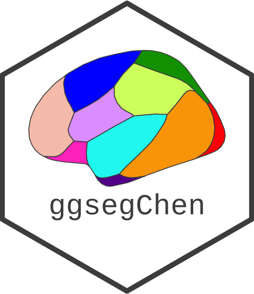

<!-- README.md is generated from README.Rmd. Please edit that file -->

```{r, include = FALSE}
knitr::opts_chunk$set(
  collapse = TRUE,
  comment = "#>",
  fig.path = "man/figures/README-",
  fig.width = 6,
  out.width = "100%",
  fig.retina = 3
)
```

# ggsegChen 

<!-- badges: start -->
[](https://zenodo.org/badge/latestdoi/250277410)
[](https://codecov.io/gh/LCBC-UiO/ggsegChen?branch=master)
[](https://github.com/LCBC-UiO/ggsegChen/actions)
[](https://CRAN.R-project.org/package=ggsegChen)
[](https://www.tidyverse.org/lifecycle/#maturing)
<!-- badges: end -->

This package contains dataset for plotting the Chen thickness and areal cortical atlas ggseg and ggseg3d. 

Chen et al. (2013) PNAS, 110 (42) 17089-17094; [pubmed](href{https://doi.org/10.1073/pnas.1308091110)

## Installation

We recommend installing the ggseg-atlases through the ggseg [r-universe](https://ggseg.r-universe.dev/ui#builds):

```{r eval = FALSE}
# Enable this universe
options(repos = c(
    ggseg = 'https://ggseg.r-universe.dev',
    CRAN = 'https://cloud.r-project.org'))

# Install some packages
install.packages('ggsegChen')
```

You can install the released version of ggsegChen from [GitHub](https://github.com/) with:

``` r
# install.packages("remotes")
remotes::install_github("LCBC-UiO/ggsegChen")
```

## Example

This is a basic example which shows you how to solve a common problem:
```{r}
library(ggsegChen)
```

```{r}
library(ggseg)
library(ggplot2)

plot(chenAr) +
  labs(title = "Chen areal (chenAr)") +
  theme(legend.position = "bottom",
        legend.text = element_text(size = 9)) +
  guides(fill = guide_legend(ncol = 3))
```
```{r fig.height = 6}
plot(chenTh) +
  labs(title = "Chen thickness (chenTh)") +
  theme(legend.position = "bottom",
        legend.text = element_text(size = 9)) +
  guides(fill = guide_legend(ncol = 2))
```

<!-- ```{r "noneval", eval=FALSE} -->
<!-- library(ggseg3d) -->

<!-- ggseg3d(atlas = desterieux_3d) %>%  -->
<!--   pan_camera("right lateral") -->
<!-- ``` -->

<!-- ```{r "orca", include=FALSE} -->
<!-- library(ggseg3d) -->

<!-- p <- ggseg3d(atlas = desterieux_3d) %>% -->
<!--   pan_camera("right lateral") %>% -->
<!--   plotly::add_annotations( text="Screen capture", -->
<!--                   legendtitle=TRUE, showarrow=FALSE, -->
<!--                   font = list(color = "#000000b4", -->
<!--                               family = 'sans serif', -->
<!--                               size = 50)) -->
<!-- plotly::orca(p, "man/figures/README-3d-plot.png") -->
<!-- ``` -->

<!-- ```{r "incl", echo=FALSE} -->
<!-- knitr::include_graphics("man/figures/README-3d-plot.png") -->
<!-- ``` -->

Please note that the 'ggsegChen' project is released with a
[Contributor Code of Conduct](CODE_OF_CONDUCT.md).
By contributing to this project, you agree to abide by its terms.
